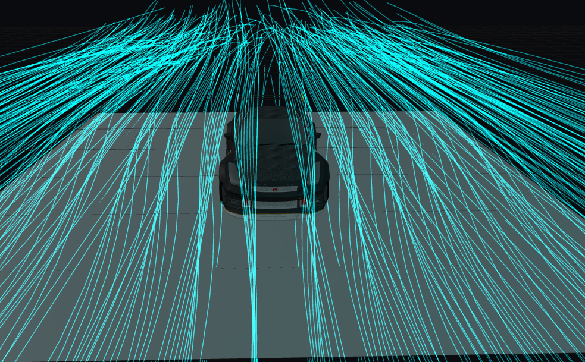
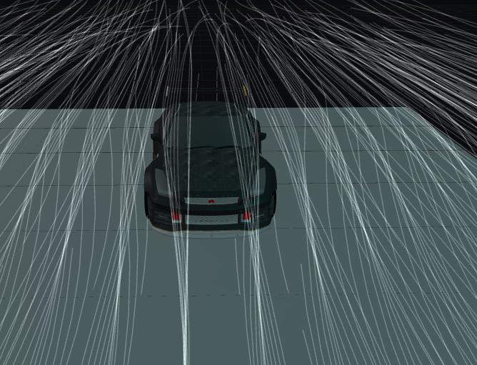
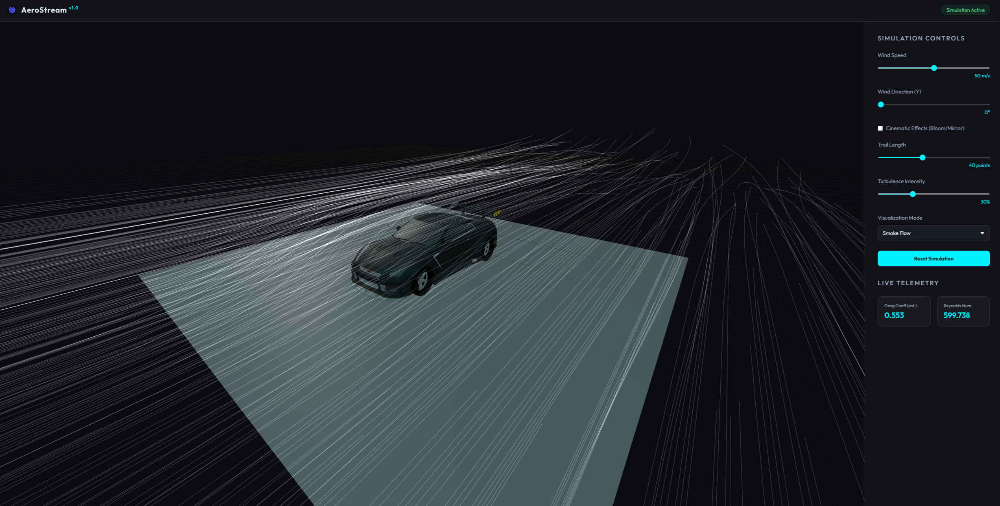
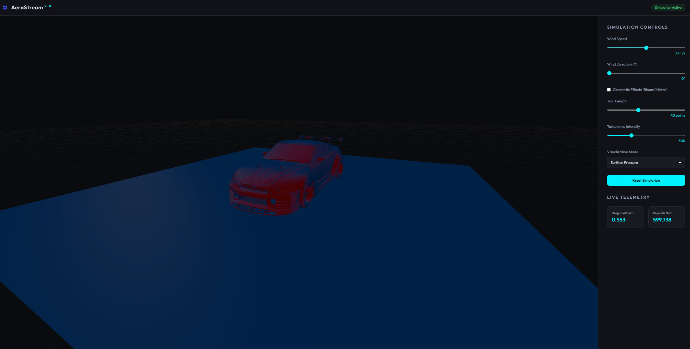

# 🌀 AeroStream - 3D Aerodynamics Simulation Platform

AeroStream is a high-end, web-based 3D aerodynamics simulation platform designed for engineers, designers, and enthusiasts. Built with **PHP MVC** and **Three.js**, it allows users to visualize wind resistance and fluid dynamics around complex 3D models with professional-grade cinematic effects.

> **AeroStream**, karmaşık 3D modellerin aerodinamik performansını web tarayıcısı üzerinden analiz etmenizi sağlayan sinematik bir rüzgar tüneli simülatörüdür. Gerçek zamanlı akış çizgileri, ısı haritaları ve türbülans efektleriyle profesyonel bir görselleştirme sunar.



## 📸 Showcase Gallery

<p align="center">
  
  
</p>
<p align="center">
  
  
</p>

## ✨ Key Features

- **🚀 Instant Model Analysis**: Drag and drop any `.glb` or `.gltf` model (like the GTR-35) to start the simulation instantly.
- **🎬 Cinematic Wind Tunnel**: Experience visual excellence with:
  - **Neon Streamlines**: Glowing parallel lines showing structured air flow.
  - **Smoke Flow**: Realistic volumetric smoke trails.
  - **Unreal Bloom**: Professional-grade lighting and glow effects.
  - **Reflective Ground**: Mirror floor for high-end presentation.
- **🔥 Deep Heatmap Analysis**: 
  - **Hot Spots (Red)**: Areas of high impact and pressure.
  - **Cold Spots (Blue)**: Aerodynamic regions with low resistance.
- **🌀 Advanced Turbulence**: Simulates complex wake vortices behind the vehicle using simulated curl noise logic.
- **⚙️ Interactive Dashboard**:
  - Control Wind Speed & Direction.
  - Adjust Turbulence Intensity.
  - Toggle **Cinematic Mode** for hardware performance management.
- **📊 Live Telemetry**: Estimated Drag Coefficient and Reynolds Number updates in real-time.

## 🛠️ Technology Stack

- **Backend**: PHP 8.x (Vanilla MVC Architecture)
- **Frontend 3D Engine**: Three.js (r160) with ESM integration
- **Styling**: Vanilla CSS3 (Glassmorphism & Modern UI)
- **Post-Processing**: EffectComposer, UnrealBloomPass, RenderPass
- **Server**: Apache / Laragon compatible

## 🚀 Installation & Setup

1. **Clone the Repository**:
   ```bash
   git clone https://github.com/your-username/aerostream.git
   ```

2. **Web Server Setup**:
   - Move the directory to your web root (e.g., `C:\laragon\www\aerostream`).
   - Ensure your Apache server has `mod_rewrite` enabled.
   - Set the `DocumentRoot` to the `public/` folder OR access via `localhost/aerostream/public`.

3. **PHP Configuration**:
   AeroStream supports large model uploads (up to 500MB). Adjust your `php.ini` or `.htaccess`:
   ```ini
   upload_max_filesize = 500M
   post_max_size = 500M
   memory_limit = 512M
   ```

4. **Directory Permissions**:
   Ensure the `public/uploads/` directory is writable by the server.

## 📖 Usage

1. Open the application in your browser.
2. Drag and drop a **GLB** model into the workspace.
3. Use the **Simulation Controls** on the right to adjust environment settings.
4. Toggle between **Streamlines**, **Smoke**, and **Pressure Map** modes.
5. If the simulation lags, uncheck **Cinematic Effects** for high-performance mode.

## ⚖️ License

Distributed under the MIT License. See `LICENSE` for more information.

## Drive Link GTR35
https://drive.google.com/file/d/13sMYbRCl3VGkwgRJgNJ0EgnNx8DeqlT-/view?usp=sharing
---
**Developed with ❤️ by [Bünyamin Efe]**
